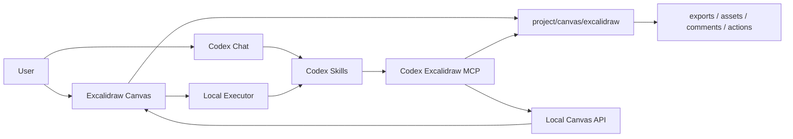

<p align="center">
  
</p>

<h1 align="center">Codex Excalidraw</h1>

<p align="center">
  A local-first Excalidraw canvas plugin for Codex App.
</p>

<p align="center">
  <a href="./README.md">English</a> |
  <a href="./README.zh.md">简体中文</a>
</p>

<p align="center">
  
  
  
</p>

Codex Excalidraw is a local-first Excalidraw canvas for Codex App. It gives each
project an editable hand-drawn whiteboard, then lets Codex read selections,
apply structured edits, process comments, insert generated images, and export
the result through MCP tools instead of browser-control automation.

> Status: local MVP. The plugin scaffold, skills, MCP server, browser canvas,
> project-local storage, and end-to-end tests are in place. Marketplace
> publishing assets are still being prepared.

## Highlights

- Editable infinite canvas powered by Excalidraw.
- Project-local persistence under the active workspace.
- Codex-driven drawing, updates, deletion, image insertion, comments, and export.
- Codex-style whiteboard comments bound to selected elements.
- `Run with Codex` local executor flow for multi-turn comment execution, with
  browser progress rendering and copy-command fallback.
- Official-inspired drawing guide, structured `cameraUpdate` viewport focus,
  project-local checkpoints, and structured pseudo-element deletion.
- Structured diagram IR for sequence, flowchart, class, ER, state, mindmap, and
  generic graph diagrams, with shared Excalidraw rendering.
- Progressive browser rendering for generated diagrams, plus layout validation
  and automatic repair for small shapes, low contrast, text overflow, and
  overlapping nodes.
- Multi-project session switching with project boundary checks.
- Exports to `.excalidraw`, JSON, SVG, and PNG.
- Real browser E2E coverage for core user flows.

## Screenshots and Demo

Media placeholders are reserved so the repository can be published before the
final demo assets are ready.

| Asset | Suggested path | Notes |
| --- | --- | --- |
| Product screenshot | `docs/media/canvas-overview.png` | Main canvas, toolbar, and annotation panel |
| Comment workflow GIF | `docs/media/comment-action-flow.gif` | Select elements, add comment, run with Codex |
| Image insertion screenshot | `docs/media/generated-image-insert.png` | Generated image inserted into a selected region |
| Demo video | `docs/media/demo.mp4` | 60-90 second walkthrough |

## How It Works



The browser canvas is the user-facing surface. Codex uses structured MCP/API
calls as the data path. Browser clicking and screenshots are not the mechanism
for drawing or editing.

When a local Codex CLI executor is available, the canvas can submit a structured
action directly from a comment. The page stays interactive and renders the run
status while the executor claims the action, uses MCP tools, completes the
action, and resolves the comment. If no local executor is available, the same
button falls back to copying an explicit command for the Codex chat.

## Requirements

- Node.js `^20.19.0` or `>=22.12.0`
- npm
- Codex CLI/App with plugin support
- Codex CLI on `PATH` for local `Run with Codex` execution
- Google Chrome for `npm run test:e2e`

The core canvas does not require a paid API key. AI model usage and external
image generation depend on the Codex provider or image model you choose to use.

## Install

```bash
git clone https://github.com/<owner>/codex-excalidraw.git
cd codex-excalidraw
npm install
```

Run the canvas in development mode:

```bash
npm run dev
```

Run the canvas the same way the plugin starts it for a user project:

```bash
./scripts/start-canvas.sh /path/to/user/project
```

The startup script creates the project-local canvas directory and writes the
live session file:

```text
/path/to/user/project/canvas/excalidraw/session.json
```

If the default port is busy, the script automatically chooses the next available
local port and records it in `session.json`.

## Install for Codex Agent

This repository is shaped as a Codex plugin:

```text
.codex-plugin/plugin.json
.mcp.json
skills/
mcp/
scripts/
src/
```

Ask Codex to install it with this prompt:

```text
Please install the Codex Excalidraw plugin from https://github.com/<owner>/codex-excalidraw.git.
Clone it into ~/plugins/codex-excalidraw, verify that .codex-plugin/plugin.json exists,
make sure the personal marketplace points to ./plugins/codex-excalidraw,
run codex plugin marketplace add ~,
then run codex plugin add codex-excalidraw@personal.
After installing, validate the plugin and tell me whether I should start a new conversation to load the new skills and MCP tools.
```

Manual local install:

```bash
mkdir -p ~/plugins
git clone https://github.com/<owner>/codex-excalidraw.git ~/plugins/codex-excalidraw
cd ~/plugins/codex-excalidraw
npm install
npm run build
```

Make sure `~/.agents/plugins/marketplace.json` contains a personal marketplace
entry for this plugin:

```json
{
  "name": "personal",
  "interface": {
    "displayName": "Personal"
  },
  "plugins": [
    {
      "name": "codex-excalidraw",
      "source": {
        "source": "local",
        "path": "./plugins/codex-excalidraw"
      },
      "policy": {
        "installation": "AVAILABLE",
        "authentication": "ON_INSTALL"
      },
      "category": "Productivity"
    }
  ]
}
```

Register the personal marketplace and install the plugin:

```bash
codex plugin marketplace add ~
codex plugin marketplace list
codex plugin list --available
codex plugin add codex-excalidraw@personal
```

After installation, start a new Codex App conversation so the skills and MCP
server are loaded. A smoke-test prompt:

```text
Open the Codex Excalidraw canvas for this project.
```

The plugin contributes these skills:

- `codex-excalidraw:excalidraw-open-canvas`
- `codex-excalidraw:excalidraw-draw`
- `codex-excalidraw:excalidraw-comments`
- `codex-excalidraw:excalidraw-image`
- `codex-excalidraw:excalidraw-export`
- `codex-excalidraw:excalidraw-optimize-sketch`

## Usage

### 1. Open a Project Canvas

From Codex:

```text
Open the Codex Excalidraw canvas for this project.
```

Codex should start or reuse the local service for the active project and return
the exact local URL.

### 2. Draw or Modify With Codex

Example prompts:

```text
Draw an editable architecture diagram for this project.
```

```text
Modify the selected elements and make the data flow easier to read.
```

```text
Optimize my selected rough sketch into a clean editable diagram, but keep the original beside it.
```

Targets must be structural: selected elements, explicit element IDs, comment
targets, action targets, or `customData.codex.semanticId`. The MCP layer does
not use fuzzy text matching to decide what to edit.

### 3. Use Comments as Codex Tasks

In the canvas:

1. Select one or more elements.
2. Open the annotation panel.
3. Add a comment describing the desired change.
4. Click `Run with Codex`.

If a local executor is available, the browser shows a progress card and Codex
handles the action in the background. If the executor is unavailable or disabled
in Settings, the button copies a command you can paste into Codex:

```text
Process the pending Excalidraw actions.
```

Codex reads the queued action through MCP, claims it, edits only the structural
targets recorded by the comment, completes the action, and resolves the comment.

### 4. Insert Generated Images

Manual image insertion uses Excalidraw's native image tool.

Codex-driven image insertion uses `insert_excalidraw_image` and requires a
structural placement target, such as a selected rectangle or a comment target:

```text
Generate a ramen ad image and insert it into the selected rectangle.
```

For generated images inside a bounded target, Codex should read the target
geometry before generation, include the target aspect ratio in the prompt, and
use `placement.fit: "cover"` to fill the target with Excalidraw native cropping.
Use `contain` only when the full source image must remain visible, and
`stretch` only when distortion is explicitly acceptable.

Generated assets are written under the active project only:

```text
canvas/excalidraw/assets/
```

### 5. Export

Use Codex for headless exports:

```text
Export the current canvas as excalidraw, json, and svg.
```

Use the canvas top Export dropdown for browser-rendered PNG and official
Excalidraw SVG exports.

Exported files are saved under:

```text
canvas/excalidraw/exports/
```

## Project Data

Every user project keeps its own canvas state:

```text
canvas/excalidraw/
  scene.excalidraw
  selection.json
  comments.json
  actions.json
  executor-config.json
  executor-runs.json
  executor-sessions.json
  session.json
  assets/
  exports/
  checkpoints/
```

This boundary is intentional. Canvas assets and exports should not be written to
the plugin repository, another project, or an arbitrary temporary directory.

## MCP Tools

Implemented tools:

| Tool | Purpose |
| --- | --- |
| `read_excalidraw_drawing_guide` | Read drawing conventions, palette, pseudo elements, and checkpoint workflow |
| `open_excalidraw_canvas` | Start or reuse the live local canvas service for a project |
| `get_excalidraw_session` | Inspect active project, live API, and recent projects |
| `switch_excalidraw_project` | Switch the live canvas to another project |
| `get_excalidraw_scene` | Read scene summary or elements |
| `get_excalidraw_selection` | Read selected element IDs |
| `insert_excalidraw_elements` | Insert editable Excalidraw elements |
| `update_excalidraw_elements` | Patch selected or explicitly targeted elements |
| `delete_excalidraw_elements` | Delete selected or explicitly targeted elements |
| `insert_excalidraw_image` | Insert an image into a structural target |
| `get_excalidraw_comments` | Read structured whiteboard comments |
| `add_excalidraw_comment` | Add a comment to selected or explicit targets |
| `resolve_excalidraw_comment` | Mark a comment resolved |
| `apply_excalidraw_comment_patch` | Patch elements targeted by a comment |
| `get_pending_excalidraw_actions` | Read actions submitted from the canvas |
| `claim_excalidraw_action` | Mark an action as running |
| `complete_excalidraw_action` | Complete, fail, or cancel an action |
| `save_excalidraw_checkpoint` | Save the current scene as a project-local checkpoint |
| `list_excalidraw_checkpoints` | List project-local checkpoints |
| `restore_excalidraw_checkpoint` | Restore a project-local checkpoint |
| `focus_excalidraw_viewport` | Focus the visible canvas on a scene rectangle |
| `export_excalidraw_scene` | Export `.excalidraw`, JSON, or basic SVG |

## Development

Useful commands:

```bash
npm run dev
npm run build
npm test
npm run test:e2e
npm run test:real-executor
npm run test:all
```

Script overview:

| Command | What it does |
| --- | --- |
| `npm run dev` | Start the Vite canvas app |
| `./scripts/start-canvas.sh <projectDir>` | Start the project-scoped canvas service |
| `./scripts/start-mcp.sh` | Start the MCP server used by the plugin |
| `npm test` | Run source constraints and MCP/API flow tests |
| `npm run test:e2e` | Run real Chrome E2E tests against a temporary canvas |
| `npm run test:real-executor` | Trigger the real Codex CLI executor and keep screenshots |
| `npm run test:all` | Run MCP/API tests plus browser E2E |
| `npm run build` | Build the frontend bundle |

`npm run test:e2e` covers real user-facing flows: opening a project canvas,
browser-connected native Excalidraw insertion, real mouse selection, comments,
local `Run with Codex` execution with progress rendering and no loading-screen
regression, action/comment state sync, executor settings scan, image insertion
with pixel-level render verification, project switching, exports, reload
persistence, mobile load, and artifact boundaries.

`npm run test:real-executor` intentionally triggers the real Codex CLI and may
use your configured model/provider. It is meant for local release validation,
not the default quick regression. The script keeps
`01-real-executor-running.png` and `02-real-executor-completed.png` so the
executor progress UI can be inspected.

To keep E2E screenshots for debugging:

```bash
CODEX_EXCALIDRAW_KEEP_E2E=1 npm run test:e2e
```

## Design Principles

- Prefer Excalidraw's native APIs where available.
- Keep user drawing tools inside Excalidraw's native toolbar.
- Keep Codex actions on MCP/API/file data paths, not browser-control paths.
- Let the local executor consume queued actions through structured IDs and MCP,
  not through visual automation.
- Require structural targets for edits.
- Never route edit intent by fuzzy text matching, element text, or comment text.
- Keep all generated assets and exports inside the active project.
- Preserve editable elements whenever possible; use raster images only when the
  user explicitly asks for image/photo/screenshot output or the source artifact
  is inherently bitmap.

## Documentation

- [Product document](docs/product.md)
- [Native Excalidraw capabilities](docs/excalidraw-native-capabilities.md)
- [End-to-end test cases](docs/e2e-test-cases.md)
- [Design AI brief](docs/design-ai-brief.md)
- [Skill runtime boundaries](skills/RUNTIME_BOUNDARIES.md)

## Roadmap

- Publish final screenshots and demo video.
- Package and validate marketplace distribution.
- Add a more native Codex App panel integration when the host exposes a stable
  panel API.
- Expand diagram import paths, including Mermaid-to-Excalidraw conversion.
- Add richer comment pins and review history.

## Repository Status

This repository contains the current local MVP and Codex plugin scaffold. It is
ready for local development and plugin validation, but should be treated as
pre-release until marketplace packaging, review assets, and public docs are
finalized.

## License

License is not specified yet.
