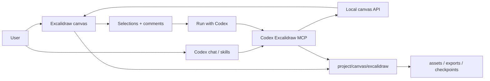

<p align="center">
  
</p>

<h1 align="center">Codex Excalidraw</h1>

<p align="center">
  Local-first editable Excalidraw canvas for Codex App.
</p>

<p align="center">
  <a href="./README.md">English</a> |
  <a href="./README.zh.md">简体中文</a>
</p>

<p align="center">
  
  
  
</p>

Codex Excalidraw adds a live Excalidraw whiteboard to Codex App. It lets Codex
draw editable architecture diagrams, improve selected canvas content, process
whiteboard comments, insert generated images into selected regions, and export
README-ready assets while keeping all canvas state inside the active project.

The goal is simple: users describe what they want to explain, not which internal
diagram renderer to use. Codex chooses the drawing path, applies layout best
practices, and writes native Excalidraw elements through structured MCP tools.


## What You Can Do

- Generate editable diagrams from natural language and project context.
- Use the normal Excalidraw infinite canvas, toolbar, shapes, text, and images.
- Select a rectangle and ask Codex to generate a realistic image inside it.
- Add comments to selected elements, then click `Run with Codex` to execute the
  task from the canvas.
- Delete resolved or open comments from the annotation list.
- Ask Codex to update, delete, recolor, clarify, or optimize selected elements.
- Export `.excalidraw`, JSON, SVG, and browser-rendered PNG files.
- Switch between project-local canvas directories without mixing project data.

## Screenshots

### Free Canvas + AI Insertion

Draw or select a bounded area on the Excalidraw canvas, then ask Codex to fill
that area with generated imagery. The image is inserted as a native Excalidraw
image element and stored with the current project.


### Quick Start Flow

The expected first-run path is install, open a project canvas, ask for a diagram,
iterate with selections or comments, then export README-ready assets.


### Editable Feedback Loop

Generated diagrams stay editable. Codex uses selections, comment targets,
semantic IDs, and action IDs instead of guessing which element to edit from
visible text.


## How It Works



The browser canvas is the user-facing surface. Codex uses MCP/API/file data
paths to draw and edit. Browser-control clicking is not the drawing mechanism.

For diagrams, Codex first reads the drawing guide, then chooses the appropriate
internal route from the user's communication goal. The user does not need to
choose between implementation names such as `flowchart` or `fireworks`.

## Diagram Quality

Codex Excalidraw renders diagrams as native Excalidraw elements rather than a
flat screenshot whenever possible. The current renderer supports:

- Architecture diagrams with grouped regions, typed nodes, arrows, and legends.
- Lane-style process and sequence views.
- Node-edge relationship diagrams such as flow, graph, class, ER, state, and
  mindmap structures.
- Progressive browser rendering so generated content appears on the live canvas.
- Layout validation and repair for text overflow, low contrast, tiny nodes, and
  overlapping blocks.
- Structured semantic IDs so later edits can target the right element without
  relying on fuzzy text matching.

Raster images are used only when the user asks for image, photo, screenshot, or
bitmap output, or when the source artifact is inherently an image.

## Install

This repository is installed as a local Codex plugin. It is not published as a
public npm package.

### Requirements

- Node.js `^20.19.0` or `>=22.12.0`
- npm
- Codex CLI/App with plugin support
- Codex CLI on `PATH` for the local `Run with Codex` executor
- Google Chrome for browser E2E tests

### 1. Clone and Build

```bash
mkdir -p ~/plugins
git clone https://github.com/jeff-dong/codex-excalidraw.git ~/plugins/codex-excalidraw
cd ~/plugins/codex-excalidraw
npm install
npm run build
```

### 2. Register a Personal Marketplace

Create or update `~/.agents/plugins/marketplace.json`:

```json
{
  "name": "personal",
  "interface": {
    "displayName": "Personal"
  },
  "plugins": [
    {
      "name": "codex-excalidraw",
      "source": {
        "source": "local",
        "path": "./plugins/codex-excalidraw"
      },
      "policy": {
        "installation": "AVAILABLE",
        "authentication": "ON_INSTALL"
      },
      "category": "Productivity"
    }
  ]
}
```

Install the plugin:

```bash
codex plugin marketplace add ~
codex plugin list --available
codex plugin add codex-excalidraw@personal
```

Start a new Codex App conversation after installation so the skills and MCP
server are loaded.

## Quick Start

Open a canvas for the current project:

```text
Open the Codex Excalidraw canvas for this project.
```

Create a diagram:

```text
Draw an editable architecture diagram for this project.
```

Improve selected content:

```text
Make the selected diagram easier to read and fix any overlapping labels.
```

Generate an image inside a selected rectangle:

```text
Generate a photorealistic product documentation image and insert it into the selected rectangle.
```

Process canvas comments:

```text
Process the pending Excalidraw actions.
```

Export the scene:

```text
Export the current canvas as excalidraw, json, svg, and png.
```

## Working With Projects

Each project has its own canvas state under:

```text
canvas/excalidraw/
  scene.excalidraw
  selection.json
  comments.json
  actions.json
  executor-config.json
  executor-runs.json
  executor-sessions.json
  session.json
  assets/
  exports/
  checkpoints/
```

To create a clean canvas for a different project, open the canvas from that
project or start the local service with an explicit directory:

```bash
./scripts/start-canvas.sh /path/to/user/project
```

The live canvas can also switch projects through the project selector or the MCP
`switch_excalidraw_project` tool. Generated assets and exports stay inside the
active project boundary.

## Comments and Local Executor

The annotation panel turns canvas feedback into structured Codex tasks:

1. Select one or more elements on the canvas.
2. Add a comment describing the change.
3. Click `Run with Codex`.
4. Watch the executor progress in the right panel.
5. Delete the comment when it is no longer needed.

If the local executor is unavailable, the button falls back to copying a command
that can be pasted into Codex Chat. Actions are claimed and completed through
MCP, so Codex edits only the selected or comment-bound targets.

## MCP Tools

Implemented tools:

| Tool | Purpose |
| --- | --- |
| `read_excalidraw_drawing_guide` | Read drawing conventions, palette, pseudo elements, and checkpoint workflow |
| `open_excalidraw_canvas` | Start or reuse the live local canvas service for a project |
| `get_excalidraw_session` | Inspect active project, live API, and recent projects |
| `switch_excalidraw_project` | Switch the live canvas to another project |
| `get_excalidraw_scene` | Read scene summary or elements |
| `get_excalidraw_selection` | Read selected element IDs |
| `insert_excalidraw_elements` | Insert editable Excalidraw elements |
| `update_excalidraw_elements` | Patch selected or explicitly targeted elements |
| `delete_excalidraw_elements` | Delete selected or explicitly targeted elements |
| `insert_excalidraw_image` | Insert an image into a structural target |
| `get_excalidraw_comments` | Read structured whiteboard comments |
| `add_excalidraw_comment` | Add a comment to selected or explicit targets |
| `resolve_excalidraw_comment` | Mark a comment resolved |
| `apply_excalidraw_comment_patch` | Patch elements targeted by a comment |
| `get_pending_excalidraw_actions` | Read actions submitted from the canvas |
| `claim_excalidraw_action` | Mark an action as running |
| `complete_excalidraw_action` | Complete, fail, or cancel an action |
| `save_excalidraw_checkpoint` | Save the current scene as a project-local checkpoint |
| `list_excalidraw_checkpoints` | List project-local checkpoints |
| `restore_excalidraw_checkpoint` | Restore a project-local checkpoint |
| `focus_excalidraw_viewport` | Focus the visible canvas on a scene rectangle |
| `export_excalidraw_scene` | Export `.excalidraw`, JSON, or basic SVG |

## Development

Useful commands:

```bash
npm run dev
npm run build
npm test
npm run test:e2e
npm run test:real-executor
npm run test:all
```

Script overview:

| Command | What it does |
| --- | --- |
| `npm run dev` | Start the Vite canvas app |
| `./scripts/start-canvas.sh <projectDir>` | Start the project-scoped canvas service |
| `./scripts/start-mcp.sh` | Start the MCP server used by the plugin |
| `npm test` | Run source constraints, layout checks, and MCP/API flow tests |
| `npm run test:e2e` | Run real Chrome E2E tests against a temporary canvas |
| `npm run test:real-executor` | Trigger the real Codex CLI executor and keep screenshots |
| `npm run test:all` | Run MCP/API tests plus browser E2E |
| `npm run build` | Build the frontend bundle |

## Safety and Boundaries

- Canvas state is local-first and stored in the active project.
- Generated assets and exports are written under `canvas/excalidraw/`.
- Edits require structural targets: selection, element IDs, comment targets,
  action targets, or `customData.codex.semanticId`.
- The MCP layer does not route edits by fuzzy element text or comment text.
- Checkpoints are project-local, so risky edits can be reviewed or restored.
- The core canvas does not require a paid API key. AI model and image generation
  costs depend on the Codex provider or image model you choose.

## Documentation

- [Product document](docs/product.md)
- [Native Excalidraw capabilities](docs/excalidraw-native-capabilities.md)
- [End-to-end test cases](docs/e2e-test-cases.md)
- [Design AI brief](docs/design-ai-brief.md)
- [Skill runtime boundaries](skills/RUNTIME_BOUNDARIES.md)

## Status

This repository contains the current local MVP and Codex plugin scaffold. The
canvas, skills, MCP server, project-local storage, comment execution loop,
image insertion, exports, and browser E2E coverage are in place. Treat it as
pre-release until marketplace packaging and public distribution are finalized.

## License

License is not specified yet.
