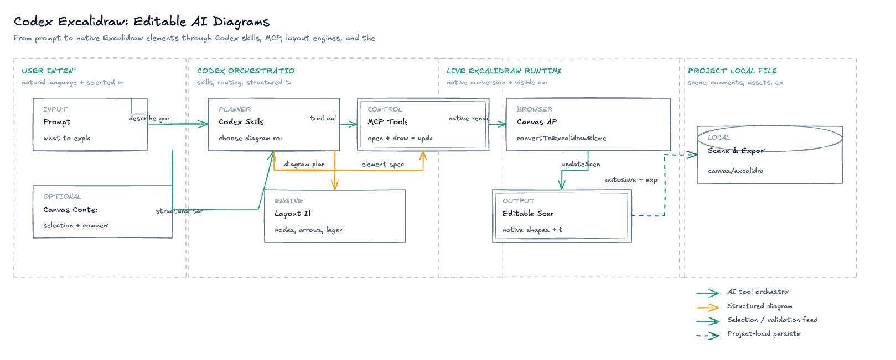
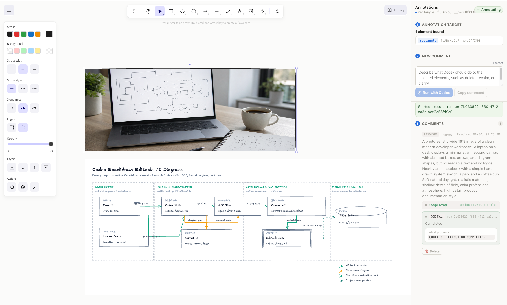
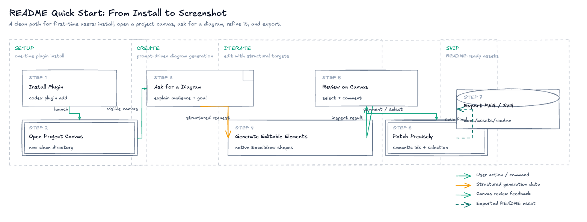
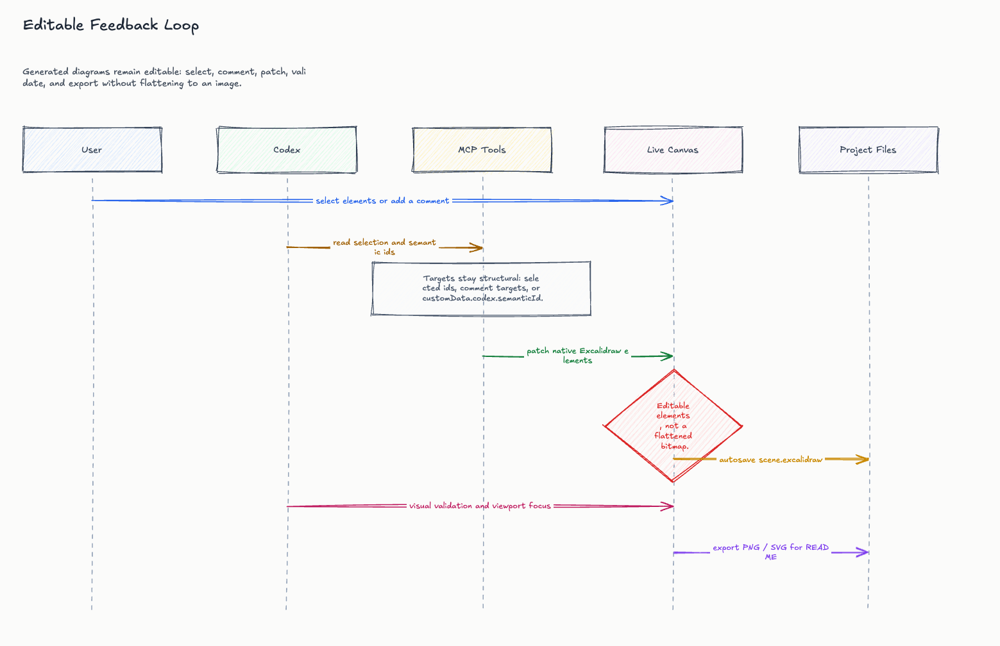
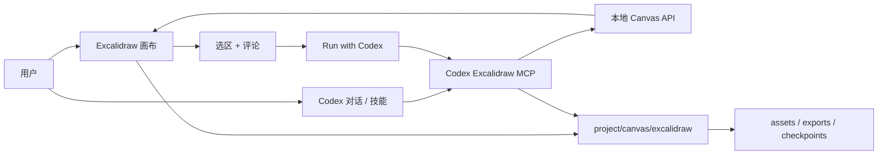

<p align="center">
  
</p>

<h1 align="center">Codex Excalidraw</h1>

<p align="center">
  面向 Codex App 的本地优先、可编辑 Excalidraw 画布插件。
</p>

<p align="center">
  <a href="./README.md">English</a> |
  <a href="./README.zh.md">简体中文</a>
</p>

<p align="center">
  
  
  
</p>

Codex Excalidraw 给 Codex App 增加了一个实时 Excalidraw 白板。它可以让 Codex
绘制可编辑架构图、优化选中的画布内容、处理白板评论、把生成图片插入选中的区域，并导出 README 可用的素材；所有画布状态都保存在当前项目里。

它的目标很明确：用户只需要描述想表达什么，不需要理解内部到底走哪种绘图实现。Codex 会根据用户目标自动选择绘图路线，应用布局最佳实践，并通过结构化 MCP 工具写入原生 Excalidraw 元素。



## 能做什么

- 根据自然语言和项目上下文生成可编辑图。
- 使用 Excalidraw 原生无限画布、工具栏、形状、文本和图片。
- 选中一个矩形，让 Codex 在这个区域内生成写实图片。
- 给选中的元素添加评论，然后点击 `Run with Codex` 从画布直接执行任务。
- 在评论列表中删除已完成或未执行的评论。
- 让 Codex 更新、删除、换色、解释或优化选中的元素。
- 导出 `.excalidraw`、JSON、SVG 和浏览器渲染 PNG。
- 在多个项目画布目录之间切换，并保持项目数据隔离。

## 截图

### 自由画布 + 框内 AI 生成

在 Excalidraw 自由画布里画出或选中一个边界区域，然后让 Codex 在这个区域内生成图片。生成结果会作为原生 Excalidraw 图片元素插入，并保存在当前项目中。



### 快速开始流程

首次使用路径是：安装插件、打开项目画布、让 Codex 生成图、通过选区或评论迭代，最后导出 README 可用素材。



### 可编辑反馈闭环

生成后的图仍然可编辑。Codex 通过选区、评论目标、语义 ID 和 action ID 定位元素，而不是靠可见文字猜测要改哪里。



## 工作原理



浏览器画布是用户操作界面。Codex 使用 MCP/API/file 数据通道来绘制和编辑，浏览器点击不是绘图机制。

生成图时，Codex 会先读取绘图指南，再根据用户想表达的内容选择内部绘图路线。用户不需要在提示词里选择 `flowchart` 或 `fireworks` 这类实现名称。

## 绘图质量

Codex Excalidraw 会尽量把图渲染为原生 Excalidraw 元素，而不是压扁成截图。目前支持：

- 架构方案图：分组区域、类型节点、箭头和图例。
- 泳道式流程图和序列视图。
- 节点关系图：flow、graph、class、ER、state、mindmap 等结构。
- 浏览器端渐进式绘制，让生成内容出现在实时画布上。
- 插入前做布局校验和修复，降低文字溢出、低对比度、节点过小和区块重叠风险。
- 给元素写入结构化语义 ID，后续编辑不依赖模糊文本匹配。

只有当用户明确要求图片、照片、截图、bitmap，或源产物天然就是图片时，才会使用栅格图片。

## 安装

这个项目作为本地 Codex 插件安装，不是公开 npm 包。

### 环境要求

- Node.js `^20.19.0` 或 `>=22.12.0`
- npm
- 支持插件的 Codex CLI/App
- 如果要使用本地 `Run with Codex` 执行器，需要 Codex CLI 在 `PATH` 中
- 运行浏览器 E2E 测试需要 Google Chrome

### 1. 克隆并构建

```bash
mkdir -p ~/plugins
git clone https://github.com/jeff-dong/codex-excalidraw.git ~/plugins/codex-excalidraw
cd ~/plugins/codex-excalidraw
npm install
npm run build
```

### 2. 注册 personal marketplace

创建或更新 `~/.agents/plugins/marketplace.json`：

```json
{
  "name": "personal",
  "interface": {
    "displayName": "Personal"
  },
  "plugins": [
    {
      "name": "codex-excalidraw",
      "source": {
        "source": "local",
        "path": "./plugins/codex-excalidraw"
      },
      "policy": {
        "installation": "AVAILABLE",
        "authentication": "ON_INSTALL"
      },
      "category": "Productivity"
    }
  ]
}
```

安装插件：

```bash
codex plugin marketplace add ~
codex plugin list --available
codex plugin add codex-excalidraw@personal
```

安装完成后，开启一个新的 Codex App 对话，让新的 skills 和 MCP server 被加载。

## 快速开始

打开当前项目画布：

```text
Open the Codex Excalidraw canvas for this project.
```

生成项目架构图：

```text
根据这个项目的架构设计绘制一个架构方案图。
```

优化选中的内容：

```text
让选中的图更容易阅读，并修复重叠标签。
```

在选中矩形内生成图片：

```text
生成一张写实的产品文档配图，并插入到选中的矩形里。
```

处理画布评论：

```text
Process the pending Excalidraw actions.
```

导出当前画布：

```text
Export the current canvas as excalidraw, json, svg, and png.
```

## 多项目画布

每个项目都有自己的画布状态目录：

```text
canvas/excalidraw/
  scene.excalidraw
  selection.json
  comments.json
  actions.json
  executor-config.json
  executor-runs.json
  executor-sessions.json
  session.json
  assets/
  exports/
  checkpoints/
```

如果想为另一个目录创建干净画布，可以在那个项目里打开画布，也可以显式指定目录启动：

```bash
./scripts/start-canvas.sh /path/to/user/project
```

实时画布也可以通过项目选择器或 MCP 工具 `switch_excalidraw_project` 切换项目。生成资产和导出结果会留在当前项目边界内。

## 评论和本地执行器

右侧注释面板可以把画布反馈变成结构化 Codex 任务：

1. 在画布中选择一个或多个元素。
2. 添加一条描述修改意图的评论。
3. 点击 `Run with Codex`。
4. 在右侧面板查看执行进度。
5. 不再需要时，可以删除这条评论。

如果本地执行器不可用，按钮会退回到复制指令，用户可以粘贴到 Codex Chat 执行。action 通过 MCP claim 和 complete，因此 Codex 只会编辑选区或评论绑定的结构化目标。

## MCP 工具

已实现工具：

| 工具 | 用途 |
| --- | --- |
| `read_excalidraw_drawing_guide` | 读取绘图规范、配色、伪元素和 checkpoint 工作流 |
| `open_excalidraw_canvas` | 为项目启动或复用 live local canvas service |
| `get_excalidraw_session` | 查看当前项目、live API 和最近项目 |
| `switch_excalidraw_project` | 把 live canvas 切换到另一个项目 |
| `get_excalidraw_scene` | 读取 scene 摘要或元素 |
| `get_excalidraw_selection` | 读取选中元素 ID |
| `insert_excalidraw_elements` | 插入可编辑 Excalidraw 元素 |
| `update_excalidraw_elements` | 修改选中或明确指定的元素 |
| `delete_excalidraw_elements` | 删除选中或明确指定的元素 |
| `insert_excalidraw_image` | 把图片插入到结构化 target |
| `get_excalidraw_comments` | 读取结构化白板评论 |
| `add_excalidraw_comment` | 给选中或明确 target 添加评论 |
| `resolve_excalidraw_comment` | 标记评论已解决 |
| `apply_excalidraw_comment_patch` | 修改评论绑定的元素 |
| `get_pending_excalidraw_actions` | 读取页面提交的待执行 action |
| `claim_excalidraw_action` | 把 action 标记为 running |
| `complete_excalidraw_action` | 完成、失败或取消 action |
| `save_excalidraw_checkpoint` | 把当前 scene 保存为项目内 checkpoint |
| `list_excalidraw_checkpoints` | 列出项目内 checkpoint |
| `restore_excalidraw_checkpoint` | 恢复项目内 checkpoint |
| `focus_excalidraw_viewport` | 把可见画布聚焦到指定 scene 区域 |
| `export_excalidraw_scene` | 导出 `.excalidraw`、JSON 或基础 SVG |

## 开发

常用命令：

```bash
npm run dev
npm run build
npm test
npm run test:e2e
npm run test:real-executor
npm run test:all
```

脚本说明：

| 命令 | 作用 |
| --- | --- |
| `npm run dev` | 启动 Vite 画布应用 |
| `./scripts/start-canvas.sh <projectDir>` | 启动项目级画布服务 |
| `./scripts/start-mcp.sh` | 启动插件使用的 MCP server |
| `npm test` | 运行源码约束、布局检查和 MCP/API 流程测试 |
| `npm run test:e2e` | 用真实 Chrome 跑临时画布 E2E |
| `npm run test:real-executor` | 真实触发 Codex CLI，本地执行评论 action，并保留截图 |
| `npm run test:all` | 同时运行 MCP/API 测试和浏览器 E2E |
| `npm run build` | 构建前端 bundle |

## 安全和边界

- 画布状态本地优先，保存在当前项目中。
- 生成资产和导出文件写入 `canvas/excalidraw/`。
- 编辑必须有结构化目标：选区、元素 ID、评论目标、action 目标或 `customData.codex.semanticId`。
- MCP 层不通过模糊元素文本或评论文本做编辑路由。
- checkpoint 保存在项目内，方便检查或恢复高风险修改。
- 核心画布不需要付费 API Key。AI 模型和图片生成成本取决于你选择的 Codex provider 或图片模型。

## 文档

- [产品文档](docs/product.md)
- [Excalidraw 原生能力](docs/excalidraw-native-capabilities.md)
- [端到端测试用例](docs/e2e-test-cases.md)
- [设计 AI Brief](docs/design-ai-brief.md)
- [Skill Runtime Boundaries](skills/RUNTIME_BOUNDARIES.md)

## 状态

当前仓库包含本地 MVP 和 Codex 插件脚手架。画布、skills、MCP server、项目级本地存储、评论执行闭环、图片插入、导出和浏览器 E2E 覆盖已经完成。插件市场打包和公开分发稳定前，仍建议按 pre-release 使用。

## License

License 尚未指定。
