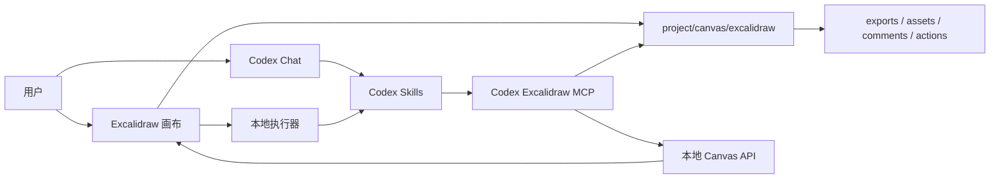

<p align="center">
  
</p>

<h1 align="center">Codex Excalidraw</h1>

<p align="center">
  面向 Codex App 的本地优先 Excalidraw 画布插件。
</p>

<p align="center">
  <a href="./README.md">English</a> |
  <a href="./README.zh.md">简体中文</a>
</p>

<p align="center">
  
  
  
</p>

Codex Excalidraw 是一个本地优先的 Excalidraw 白板插件。它为每个项目提供一个可编辑的手绘风格画布，并让 Codex 通过 MCP 工具读取选区、执行结构化修改、处理注释、插入生成图片和导出结果，而不是依赖浏览器控制来点击页面。

> 状态：本地 MVP。插件脚手架、技能、MCP Server、浏览器画布、项目级本地存储和端到端测试已经完成。插件市场发布素材仍在准备中。

## 功能亮点

- 基于 Excalidraw 的可编辑无限画布。
- 画布数据按当前项目本地保存。
- 支持 Codex 绘制、更新、删除、插图、评论和导出。
- 类似 Codex code comment 的白板注释能力，并绑定到选中的元素。
- `Run with Codex` 本地执行器流程，支持多轮注释执行、浏览器进度渲染和复制指令兜底。
- 吸收官方 MCP 的优秀能力：绘图指南、结构化 `cameraUpdate` 视口聚焦、项目内 checkpoint、结构化伪元素删除。
- 结构化 Diagram IR 覆盖序列图、流程图、类图、ER、状态图、思维导图和通用 graph，并统一进入 Excalidraw 渲染层。
- 生成图支持浏览器端分步绘制，并在插入前做 layout validation，自动修复过小节点、低对比度、文字溢出和节点重叠风险。
- 多项目 session 切换，并验证项目边界。
- 支持导出 `.excalidraw`、JSON、SVG 和 PNG。
- 已覆盖核心用户动线的真实浏览器 E2E 测试。

## 截图和演示

这里预留截图和视频位置，方便先发布仓库，再补齐最终演示素材。

| 素材 | 建议路径 | 说明 |
| --- | --- | --- |
| 产品截图 | `docs/media/canvas-overview.png` | 主画布、顶部工具栏和注释面板 |
| 评论流程 GIF | `docs/media/comment-action-flow.gif` | 选中元素、添加评论、交给 Codex 执行 |
| 图片插入截图 | `docs/media/generated-image-insert.png` | 生成图片并插入到选中的区域 |
| 演示视频 | `docs/media/demo.mp4` | 60-90 秒产品 walkthrough |

## 工作原理



浏览器画布是用户操作界面。Codex 使用结构化 MCP/API 调用作为数据通道。浏览器点击和截图不是绘制或编辑画布的机制。

如果本机可用 Codex CLI，画布可以从评论直接提交结构化 action。页面会保持可操作，并显示执行进度；本地执行器会 claim action、调用 MCP 工具、完成 action 并 resolve comment。如果本地执行器不可用，按钮会退回到复制明确指令，由用户粘贴到 Codex Chat 中执行。

## 环境要求

- Node.js `^20.19.0` 或 `>=22.12.0`
- npm
- 支持插件的 Codex CLI/App
- 如果要直接点击 `Run with Codex` 本地执行，需要 Codex CLI 在 `PATH` 中
- 运行 `npm run test:e2e` 需要 Google Chrome

核心画布不需要付费 API Key。AI 模型调用和外部图片生成是否付费，取决于你选择的 Codex provider 或图片生成模型。

## 安装

```bash
git clone https://github.com/<owner>/codex-excalidraw.git
cd codex-excalidraw
npm install
```

开发模式启动画布：

```bash
npm run dev
```

按插件实际启动方式，为某个用户项目启动画布：

```bash
./scripts/start-canvas.sh /path/to/user/project
```

启动脚本会创建项目级画布目录，并写入 live session 文件：

```text
/path/to/user/project/canvas/excalidraw/session.json
```

如果默认端口被占用，脚本会自动选择下一个可用本地端口，并写入 `session.json`。

## 安装到 Codex Agent

这个仓库按 Codex 插件形态组织：

```text
.codex-plugin/plugin.json
.mcp.json
skills/
mcp/
scripts/
src/
```

你可以把下面这段发给 Codex，让它帮你安装：

```text
Please install the Codex Excalidraw plugin from https://github.com/<owner>/codex-excalidraw.git.
Clone it into ~/plugins/codex-excalidraw, verify that .codex-plugin/plugin.json exists,
make sure the personal marketplace points to ./plugins/codex-excalidraw,
run codex plugin marketplace add ~,
then run codex plugin add codex-excalidraw@personal.
After installing, validate the plugin and tell me whether I should start a new conversation to load the new skills and MCP tools.
```

手动本地安装：

```bash
mkdir -p ~/plugins
git clone https://github.com/<owner>/codex-excalidraw.git ~/plugins/codex-excalidraw
cd ~/plugins/codex-excalidraw
npm install
npm run build
```

确认 `~/.agents/plugins/marketplace.json` 中包含 personal marketplace 的插件条目：

```json
{
  "name": "personal",
  "interface": {
    "displayName": "Personal"
  },
  "plugins": [
    {
      "name": "codex-excalidraw",
      "source": {
        "source": "local",
        "path": "./plugins/codex-excalidraw"
      },
      "policy": {
        "installation": "AVAILABLE",
        "authentication": "ON_INSTALL"
      },
      "category": "Productivity"
    }
  ]
}
```

注册 personal marketplace 并安装插件：

```bash
codex plugin marketplace add ~
codex plugin marketplace list
codex plugin list --available
codex plugin add codex-excalidraw@personal
```

安装后，开启一个新的 Codex App 对话，让新的 skills 和 MCP server 被加载。烟测提示词：

```text
Open the Codex Excalidraw canvas for this project.
```

插件提供这些技能：

- `codex-excalidraw:excalidraw-open-canvas`
- `codex-excalidraw:excalidraw-draw`
- `codex-excalidraw:excalidraw-comments`
- `codex-excalidraw:excalidraw-image`
- `codex-excalidraw:excalidraw-export`
- `codex-excalidraw:excalidraw-optimize-sketch`

## 使用方式

### 1. 打开项目画布

在 Codex 中输入：

```text
Open the Codex Excalidraw canvas for this project.
```

Codex 应该为当前项目启动或复用本地服务，并返回准确的本地 URL。

### 2. 让 Codex 绘制或修改

示例提示词：

```text
Draw an editable architecture diagram for this project.
```

```text
Modify the selected elements and make the data flow easier to read.
```

```text
Optimize my selected rough sketch into a clean editable diagram, but keep the original beside it.
```

修改目标必须来自结构化信息：选中的元素、明确元素 ID、comment target、action target，或 `customData.codex.semanticId`。MCP 层不会通过模糊文本匹配来判断要修改哪个对象。

### 3. 把注释作为 Codex 任务

在画布中：

1. 选择一个或多个元素。
2. 打开注释面板。
3. 添加一条描述修改意图的评论。
4. 点击 `Run with Codex`。

如果本地执行器可用，浏览器会显示执行进度，Codex 在后台处理这条 action。如果执行器不可用，或在 Settings 中切到复制指令模式，按钮会复制一条可以粘贴到 Codex 的命令：

```text
Process the pending Excalidraw actions.
```

Codex 会通过 MCP 读取 queued action，claim 后只编辑该 comment 记录的结构化 target，完成 action，并 resolve comment。

### 4. 插入生成图片

用户手动插入图片时，使用 Excalidraw 原生图片工具。

Codex 自动插入图片时，使用 `insert_excalidraw_image`，并要求结构化放置目标，例如选中的矩形或 comment target：

```text
Generate a ramen ad image and insert it into the selected rectangle.
```

如果是给一个有边界的目标区域生成图片，Codex 应先读取目标元素几何，把目标宽高比写入生图提示词，并用
`placement.fit: "cover"` 通过 Excalidraw 原生裁切铺满目标区域。只有用户要求完整保留图片时才用 `contain`；
只有用户明确接受变形时才用 `stretch`。

生成资产只会写入当前项目：

```text
canvas/excalidraw/assets/
```

### 5. 导出

用 Codex 做 headless 导出：

```text
Export the current canvas as excalidraw, json, and svg.
```

用画布顶部 Export 下拉菜单导出浏览器渲染的 PNG 和官方 Excalidraw SVG。

导出文件会保存到：

```text
canvas/excalidraw/exports/
```

## 项目数据

每个用户项目保留自己的画布状态：

```text
canvas/excalidraw/
  scene.excalidraw
  selection.json
  comments.json
  actions.json
  executor-config.json
  executor-runs.json
  executor-sessions.json
  session.json
  assets/
  exports/
  checkpoints/
```

这个边界是产品约束。画布资产和导出文件不应该写入插件仓库、其他项目或任意临时目录。

## MCP 工具

已实现工具：

| 工具 | 用途 |
| --- | --- |
| `read_excalidraw_drawing_guide` | 读取绘图规范、配色、伪元素和 checkpoint 工作流 |
| `open_excalidraw_canvas` | 为项目启动或复用 live local canvas service |
| `get_excalidraw_session` | 查看当前项目、live API 和最近项目 |
| `switch_excalidraw_project` | 把 live canvas 切换到另一个项目 |
| `get_excalidraw_scene` | 读取 scene 摘要或元素 |
| `get_excalidraw_selection` | 读取选中元素 ID |
| `insert_excalidraw_elements` | 插入可编辑 Excalidraw 元素 |
| `update_excalidraw_elements` | 修改选中或明确指定的元素 |
| `delete_excalidraw_elements` | 删除选中或明确指定的元素 |
| `insert_excalidraw_image` | 把图片插入到结构化 target |
| `get_excalidraw_comments` | 读取结构化白板评论 |
| `add_excalidraw_comment` | 给选中或明确 target 添加评论 |
| `resolve_excalidraw_comment` | 标记评论已解决 |
| `apply_excalidraw_comment_patch` | 修改评论绑定的元素 |
| `get_pending_excalidraw_actions` | 读取页面提交的待执行 action |
| `claim_excalidraw_action` | 把 action 标记为 running |
| `complete_excalidraw_action` | 完成、失败或取消 action |
| `save_excalidraw_checkpoint` | 把当前 scene 保存为项目内 checkpoint |
| `list_excalidraw_checkpoints` | 列出项目内 checkpoint |
| `restore_excalidraw_checkpoint` | 恢复项目内 checkpoint |
| `focus_excalidraw_viewport` | 把可见画布聚焦到指定 scene 区域 |
| `export_excalidraw_scene` | 导出 `.excalidraw`、JSON 或基础 SVG |

## 开发

常用命令：

```bash
npm run dev
npm run build
npm test
npm run test:e2e
npm run test:real-executor
npm run test:all
```

脚本说明：

| 命令 | 作用 |
| --- | --- |
| `npm run dev` | 启动 Vite 画布应用 |
| `./scripts/start-canvas.sh <projectDir>` | 启动项目级画布服务 |
| `./scripts/start-mcp.sh` | 启动插件使用的 MCP server |
| `npm test` | 运行源码约束和 MCP/API 流程测试 |
| `npm run test:e2e` | 用真实 Chrome 跑临时画布 E2E |
| `npm run test:real-executor` | 真实触发 Codex CLI，本地执行评论 action，并保留截图 |
| `npm run test:all` | 同时运行 MCP/API 测试和浏览器 E2E |
| `npm run build` | 构建前端 bundle |

`npm run test:e2e` 覆盖真实用户操作：打开项目画布、浏览器连接的 Excalidraw 原生插入、真实鼠标选区、评论、mock 本地执行器的 `Run with Codex` 进度渲染和不白屏断言、action/comment 状态同步、执行器设置扫描、图片插入并做像素级可见性验证、项目切换、导出、刷新恢复、移动端加载和产物边界检查。

`npm run test:real-executor` 会真实触发 Codex CLI 和模型调用，适合发布前或本机验收时运行。它会保留 `01-real-executor-running.png` 和 `02-real-executor-completed.png`，用于检查执行中的页面表现。

保留 E2E 截图用于调试：

```bash
CODEX_EXCALIDRAW_KEEP_E2E=1 npm run test:e2e
```

## 设计原则

- 优先使用 Excalidraw 原生 API。
- 用户绘制工具保留在 Excalidraw 原生工具栏中。
- Codex 操作走 MCP/API/file 数据通道，而不是浏览器控制通道。
- 本地执行器通过结构化 action id、target ids 和 MCP 消费任务，不通过视觉自动化。
- 所有修改必须有结构化 target。
- 不通过模糊文本、元素文本或 comment 文本判断修改目标。
- 生成资产和导出结果必须留在当前项目内。
- 尽量保留可编辑元素；只有用户明确要求图片、照片、截图，或源产物天然是 bitmap 时才使用栅格图。

## 文档

- [产品文档](docs/product.md)
- [Excalidraw 原生能力](docs/excalidraw-native-capabilities.md)
- [端到端测试用例](docs/e2e-test-cases.md)
- [设计 AI Brief](docs/design-ai-brief.md)
- [Skill Runtime Boundaries](skills/RUNTIME_BOUNDARIES.md)

## Roadmap

- 补齐最终截图和演示视频。
- 完成插件市场打包和验证。
- 等 Codex App 暴露稳定 panel API 后，接入更原生的 Codex App panel。
- 扩展图表导入路径，包括 Mermaid-to-Excalidraw。
- 增强 comment pin 和 review history。

## 仓库状态

当前仓库包含本地 MVP 和 Codex 插件脚手架。它可以用于本地开发和插件验证，但在插件市场打包、review 素材和公开文档稳定之前，应视为 pre-release。

## License

License 尚未指定。
