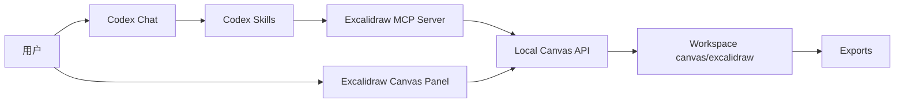
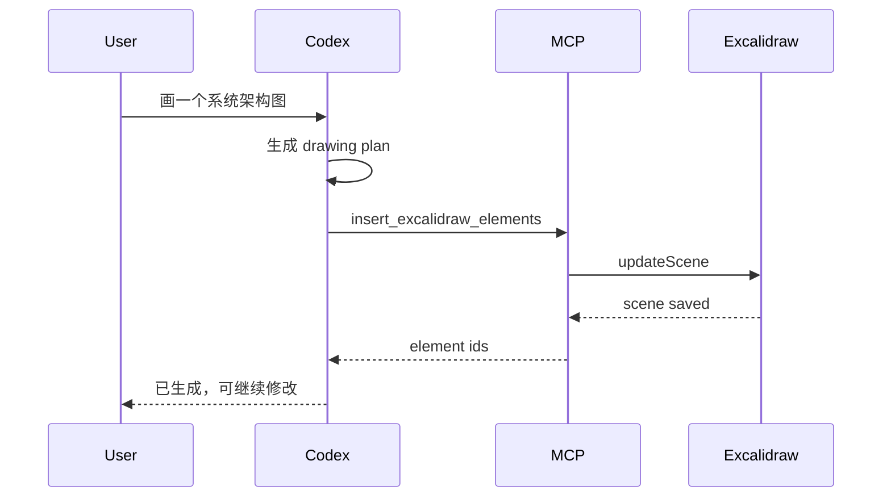
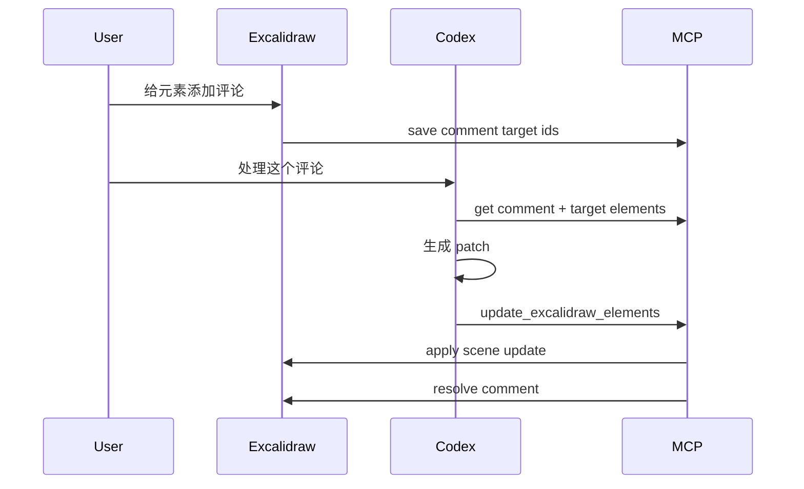

# Codex Excalidraw Canvas 产品文档

## 1. 背景

当前 Cowart 项目已经验证了一条有效路径：在 Codex 中启动一个本地无限画布，把画布状态保存到当前用户项目，并通过 MCP 工具让 Codex 读取选区、写入元素、处理评论和导出。

下一阶段目标是做一个 Excalidraw 版本。相比 tldraw，Excalidraw 的优势是手绘风格天然成立，`.excalidraw` JSON 是开放格式，官方 React 组件支持嵌入、程序化创建元素、读取 scene、写入 scene、读取 files、导出 PNG/SVG/Blob 等能力。

最终形态不是一个独立网页工具，而是一个植入 Codex App 的本地视觉工作台：用户在画布窗口中直接画、选中、评论和检查结果，在 Codex 输入框中提出绘制、修改、解释、增强和导出需求，Codex 通过 MCP/API 结构化操作 Excalidraw 白板。

## 2. 产品定位

Codex Excalidraw Canvas 是面向 Codex App 的本地 AI 白板插件。

它提供一个可编辑的手绘风格无限画布，让用户通过两种方式共同创作：

1. 直接在 Excalidraw 白板上画、写、拖拽和标注。
2. 通过 Codex 问答，让 AI 生成图、修改图、解释图、优化手绘内容。

产品不是替代 Excalidraw 官方云服务，也不是多人在线协作平台。第一阶段优先服务单人本地工作流，把 Codex 的代理能力和 Excalidraw 的开放画布结合起来。

## 3. 核心用户场景

### 3.1 问答式绘制

用户在 Codex 中输入：

```text
帮我画一个 Codex App 内嵌 Excalidraw 的架构图，包含 App、MCP、本地服务、画布存储、导出流程。
```

系统行为：

1. Codex 理解用户意图。
2. 生成结构化 drawing plan。
3. 转换为 Excalidraw elements。
4. 写入当前白板。
5. 自动定位到新生成内容。
6. 返回简短说明。

关键要求：

- 生成的内容必须是可编辑 Excalidraw 元素，不是单张不可编辑截图。
- 元素需要带 `customData`，记录来源、语义角色、分组、生成批次。
- 后续修改必须优先基于元素 ID、选区、`customData` 和评论 targetId，不依赖模糊文本匹配。

### 3.2 问答式修改

用户可以选中画布上的一组元素，然后说：

```text
把这组内容改成三层架构，左边是用户，中间是 Codex，右边是本地白板服务。
```

系统行为：

1. MCP 读取当前选区。
2. Codex 基于选中元素生成 patch。
3. 应用 patch 到对应元素。
4. 保留可撤销历史，必要时保存修改前快照。

优先级：

1. 选区修改，最可靠。
2. 评论 targetId 修改，可靠。
3. `customData.semanticId` 修改，可靠。
4. 位置描述、颜色描述、自然语言指代，只能生成候选 plan，必须让用户确认或转成结构化 target 后再执行。

MCP 工具层禁止通过元素文本包含关系来判断路由、分支或修改目标。文本只可以作为候选展示给用户确认，不能直接驱动修改。

### 3.3 注释增强和直接修改

产品需要提供类似 Codex code comment 的白板注释能力。

注释不是普通文本框，而是结构化评论：

```json
{
  "id": "comment_01",
  "targetElementIds": ["element_a", "element_b"],
  "body": "这里改成三步流程，去掉实现细节",
  "status": "open",
  "createdBy": "user",
  "createdAt": "2026-06-22T00:00:00.000Z"
}
```

评论可以进一步提交为结构化 action：

```json
{
  "id": "action_01",
  "type": "comment",
  "status": "queued",
  "commentId": "comment_01",
  "targetElementIds": ["element_a", "element_b"],
  "instruction": "这里改成三步流程，去掉实现细节",
  "source": "canvas-comment"
}
```

交互形态：

```text
+-------------------------------------------------------------+
| Excalidraw Canvas                                           |
|                                                             |
|  [架构图元素]  <-- comment pin                              |
|                                                             |
|                                      +-------------------+  |
|                                      | Comments          |  |
|                                      | - open            |  |
|                                      | - resolved        |  |
|                                      | - Run with Codex  |  |
|                                      +-------------------+  |
+-------------------------------------------------------------+
```

能力：

- 选中元素后添加评论。
- 评论绑定一个或多个元素 ID。
- 评论可以通过 `Run with Codex` 转成 pending action。
- Codex 读取 action、claim、执行结构化修改、complete action。
- 修改完成后 action 进入 completed，关联评论进入 resolved。
- 用户可以查看评论前后的 diff 摘要。

重要边界：

- 评论数据不应只存在画布文本元素里，需要保存为结构化 JSON。
- 可以在画布上显示 pin 或 comment badge，但 source of truth 是评论存储。
- action 队列是页面到 Codex 的任务桥，source of truth 是 `actions.json`。
- AI 处理评论时必须用 targetElementIds 锁定修改范围。
- 页面不能通过评论文本硬编码判断“删除/修改/生成”等意图；自然语言 instruction 只能交给 Codex 侧理解，再通过结构化 MCP 工具执行。

### 3.4 多格式导出

第一阶段支持：

- `.excalidraw`
- `.png`
- `.svg`
- `.json`

第二阶段支持：

- `.pdf`
- `.pptx`
- Markdown 中嵌入 PNG/SVG
- Codex 消息内预览图

导出来源：

- 当前完整 scene。
- 当前选区。
- 指定 frame。
- 指定评论线程关联元素。

导出目标：

```text
canvas/excalidraw/exports/
  2026-06-22-architecture.excalidraw
  2026-06-22-architecture.png
  2026-06-22-architecture.svg
```

### 3.5 图片生成和插入

当前口径是保留能力，但不把它做成干扰主流程的独立素材库：

1. 用户手动插图时，使用 Excalidraw 原生 image tool，不在宿主顶部栏再做一个重复的“图片”按钮。
2. Codex 自动插图时，使用 `insert_excalidraw_image`，只在用户明确要求 bitmap/image/photo/screenshot 或源产物本身就是图片时执行。
3. 插入位置必须来自结构化 target：选区、comment target、action target、显式 element id 或 `customData.codex.semanticId`。
4. 对有边界的目标区域，Codex 必须先读取目标几何，把目标宽高比传入生图提示词，并用 `placement.fit: "cover"` 通过 Excalidraw `crop` 铺满区域；`contain` 只用于必须完整保留源图的场景，`stretch` 只用于用户明确接受变形的场景。
5. 图片资产写入当前项目的 `canvas/excalidraw/assets/`，scene `files[fileId]` 保存 Excalidraw 渲染需要的数据。

仍然不做：

- 独立素材库。
- 图片资产管理器。
- 宿主顶部栏里的自定义图片上传按钮。
- 页面侧根据评论文本判断“生成图片/替换图片”等意图。

### 3.6 优化用户手绘内容

用户在画布上手绘草图后，可以说：

```text
把我选中的草图整理成干净的系统架构图，保留原意，放在右侧。
```

系统行为：

1. 读取选中元素。
2. 分析手绘内容、文本、箭头关系。
3. 生成结构化 diagram plan。
4. 在原稿旁边创建优化版。
5. 保留原始草图。

原则：

- 默认不覆盖用户原稿。
- 优化结果必须可编辑。
- 对无法确定的关系，用待确认评论标出。

## 4. 功能范围

### 4.1 MVP

MVP 目标是打通 Codex App 内的本地 Excalidraw 白板和结构化 AI 操作。

必须包含：

| 模块 | 功能 | 说明 |
|---|---|---|
| 本地画布 | 打开 Excalidraw | 从 Codex 启动本地 Vite 服务 |
| 本地持久化 | 保存 scene | 保存 `.excalidraw`、view state |
| MCP 读状态 | 获取选区 | 返回 selected elements、appState、comments 摘要 |
| MCP 写元素 | 插入元素 | Codex 生成 Excalidraw elements 并插入 |
| MCP 修改元素 | 更新元素 | 基于选区或 ID patch scene |
| 评论 | 添加和处理评论 | 评论绑定 targetElementIds，可直接应用 patch 并 resolve |
| Action 队列 | 页面提交给 Codex 执行 | `Run with Codex` 创建 pending action，MCP claim/complete |
| 导出 | Excalidraw/JSON/SVG/PNG | MCP 支持 `.excalidraw`、JSON、基础 SVG；PNG 使用 Excalidraw 前端渲染按钮 |
| 图片 | 原生图片工具和 Codex 图片插入 | 手动插图走 Excalidraw 原生工具；Codex 明确图片请求走 `insert_excalidraw_image` |
| Codex 技能 | open / draw / edit / export | 提供明确技能入口 |

不包含：

- 多人实时协作。
- 官方 Excalidraw+ 云同步。
- 用户账号体系。
- 云端素材库。
- 完整团队权限管理。
- 独立图片素材管理器。

### 4.2 V1

V1 在 MVP 上增加 AI 视觉工作流：

- 评论系统。
- 评论直接修改。
- 手绘草图优化。
- Prompt 生成图表。
- 统一 Diagram IR：序列图走 lane/order 规则布局，流程图、类图、ER、状态图、思维导图和通用图走 node-edge IR + ELK 布局，再进入统一 Excalidraw 渲染层。
- Mermaid 作为后续输入/导入来源，必须先转换成 Diagram IR，不能直接作为最终视觉渲染路径。
- 选区解释和总结。
- 局部重排和样式统一。

### 4.3 V2

V2 面向更完整的 Codex App 体验：

- Codex App 内原生面板，而不是外部浏览器标签。
- 画布和聊天双向引用。
- 白板评论出现在 Codex 任务列表。
- 导出到报告、PPT、Markdown。
- 视觉 diff。
- 多版本历史。
- 可选远程协作服务。

## 5. 最终嵌入 Codex App 的形态

### 5.1 用户体验

最终用户不需要知道本地服务细节。

理想入口：

```text
Codex App
  ├─ Chat
  ├─ Files
  ├─ Terminal
  └─ Canvas
       └─ Excalidraw Whiteboard
```

用户可以：

- 在 Codex 中说“打开白板”。
- 在白板中手动画图。
- 在 Codex 中说“把选中的图优化一下”。
- 在白板上添加评论。
- 在 Codex 中说“处理所有 open comments”。
- 在 Codex 中导出当前图。
- 通过顶部标题栏的项目下拉菜单切换历史项目或打开一个新项目目录。

### 5.2 交互边界

这个产品不应该依赖 Codex 的浏览器控制能力来操作画布。

正确边界：

- 画布窗口负责人类交互：绘制、拖拽、选择、缩放、添加评论、查看结果。
- Codex 输入框负责 AI 意图：生成图、修改选区、根据评论改图、导出。
- MCP/API 负责状态桥接：读取 scene、selection、comments，写入 elements、comments、exports。

打开页面时应优先使用 Codex App 内置浏览器。不能调用系统默认浏览器作为默认体验。浏览器控制最多只能作为一次性的“打开 URL 到内置浏览器”便利动作。不能让 Codex 通过截图识别白板、反复移动鼠标、点击工具栏来完成核心流程，这会消耗大量 token，且稳定性差。

### 5.3 App 内嵌策略

短期：

- 本地 Vite 服务运行在 `127.0.0.1:<port>`。
- Codex 返回本地 URL；如果 Codex App 提供低成本打开 URL 的能力，可以一次性打开。
- MCP 通过 stdio 与 Codex 连接。
- 数据保存在当前 workspace。

中期：

- Codex App 提供 Canvas panel。
- 插件向 Codex App 注册 panel URL。
- App 内保留 panel/session 状态，避免反复 reload。
- MCP 工具和 panel 共享同一 projectDir/canvasDir。
- 用户可以从右侧可折叠、可拖宽的注释 panel 中选择近期 project 或新增 project；选择和导出不作为右侧菜单出现。
- 顶部工具栏在导出按钮旁提供注释 icon，作为进入/退出注释 panel 的主入口。

长期：

- Codex App 提供原生 extension view。
- Excalidraw 作为前端 bundle 被 App 承载。
- 本地服务只负责文件存储、导出和 AI 工具桥接。

## 6. 系统架构



### 6.1 前端

技术栈：

- React
- Vite
- `@excalidraw/excalidraw`

职责：

- 渲染 Excalidraw。
- 监听 scene change。
- 保存 elements/appState/files。
- 同步 selected elements。
- 展示 comments sidebar。
- 展示 AI 操作状态。
- 接收远端 scene update 并应用。

### 6.2 本地 API

建议接口：

| API | 方法 | 说明 |
|---|---|---|
| `/api/scene` | GET/PUT | 读取或保存完整 scene |
| `/api/selection` | GET/PUT | 读取或保存当前选区 |
| `/api/comments` | GET/PUT | 评论管理 |
| `/api/session` | GET/PUT | 读取或切换当前 project session |
| `/api/export` | POST | 保存前端导出的 PNG/SVG/JSON/Excalidraw 文件 |
| `/api/scene-events` | GET | SSE 推送 scene/comments changed |
| `/exports/*` | GET | 读取本地导出文件 |

启动脚本会写入：

```text
canvas/excalidraw/session.json
```

MCP 用它发现当前项目对应的本地 API，并通过 `/api/scene` 校验 `canvasDir`，避免多个项目同时打开时误写。

近期项目注册表：

```text
~/.codex-excalidraw/projects.json
```

用途：

- 记录最近打开过的 project。
- 支持用户在画布 UI 中切换 project。
- 支持 Codex 通过 `get_excalidraw_session` 确认当前 active project。

### 6.3 MCP 工具

建议工具：

| Tool | 说明 |
|---|---|
| `open_excalidraw_canvas` | 启动或复用项目级本地画布服务，并返回 live URL |
| `get_excalidraw_scene` | 读取 scene 摘要或完整 scene |
| `get_excalidraw_selection` | 读取当前选区 |
| `get_excalidraw_comments` | 读取结构化评论 |
| `get_excalidraw_session` | 读取 active project 和近期 project |
| `switch_excalidraw_project` | 切换 live canvas API 到指定 project |
| `insert_excalidraw_elements` | 插入新元素 |
| `update_excalidraw_elements` | 更新指定元素 |
| `add_excalidraw_comment` | 添加结构化评论 |
| `resolve_excalidraw_comment` | 关闭评论 |
| `apply_excalidraw_comment_patch` | 根据评论修改目标元素 |
| `export_excalidraw_scene` | 导出文件 |

后续工具：

- `delete_excalidraw_elements`：删除指定元素，默认需要明确确认。

安全要求：

- 删除和覆盖必须显式。
- 修改必须有 target：selection、elementIds、commentId 或 semanticId。
- 禁止通过模糊文本匹配做路由或分支判断。
- 如果自然语言指代不清，先生成候选并要求用户确认。

## 7. 数据模型

### 7.1 Scene 文件

主文件：

```text
canvas/excalidraw/scene.excalidraw
```

结构：

```json
{
  "type": "excalidraw",
  "version": 2,
  "source": "codex-excalidraw-canvas",
  "elements": [],
  "appState": {},
  "files": {}
}
```

### 7.2 元素 customData

所有 AI 生成或 AI 修改过的元素建议带 `customData`：

```json
{
  "customData": {
    "codex": {
      "createdBy": "codex",
      "batchId": "draw_20260622_001",
      "semanticId": "local_api_box",
      "role": "service",
      "sourcePromptId": "prompt_001"
    }
  }
}
```

用途：

- 后续精准修改。
- 支持解释和追踪。
- 支持评论绑定。
- 支持导出时按语义筛选。

### 7.3 评论文件

```text
canvas/excalidraw/comments.json
```

结构：

```json
{
  "version": 1,
  "comments": [
    {
      "id": "comment_001",
      "targetElementIds": ["element_001"],
      "body": "改成三层架构",
      "status": "open",
      "createdAt": "2026-06-22T00:00:00.000Z",
      "resolvedAt": null
    }
  ]
}
```

### 7.4 导出目录

```text
canvas/excalidraw/exports/
```

导出记录：

```json
{
  "id": "export_001",
  "format": "png",
  "source": "selection",
  "path": "canvas/excalidraw/exports/architecture.png",
  "createdAt": "2026-06-22T00:00:00.000Z"
}
```

## 8. AI 工作流设计

### 8.1 自然语言到图



### 8.2 评论到修改



### 8.3 手绘优化

流程：

1. 用户选中手绘草图。
2. MCP 返回选中 elements。
3. Codex 分析元素类型、坐标、文本、箭头连接。
4. 生成规范化 diagram plan。
5. 在右侧插入优化版。
6. 给不确定的地方添加评论。

## 9. 导出设计

### 9.1 支持格式

| 格式 | MVP | 说明 |
|---|---|---|
| `.excalidraw` | 是 | 原生源文件 |
| `.json` | 是 | 可用于调试和集成 |
| `.png` | 是 | 预览和分享；当前由前端 Excalidraw 渲染按钮导出 |
| `.svg` | 是 | 前端按钮导出官方 SVG；MCP 可导出基础结构 SVG |
| `.pdf` | V1 | 可基于 SVG/PNG 生成 |
| `.pptx` | V1/V2 | 可基于 SVG 或元素转换 |

### 9.2 导出范围

- 全画布。
- 当前选区。
- 当前 viewport。
- 指定 frame。
- 指定 comment target。

### 9.3 Codex 输出体验

导出后，Codex 应返回：

```text
已导出：
- PNG: /path/to/file.png
- SVG: /path/to/file.svg
- Excalidraw: /path/to/file.excalidraw
```

在 Codex App 中应优先显示 PNG 预览。

## 10. 权限和成本

### 10.1 免费部分

- Excalidraw 开源组件。
- 本地 Vite 服务。
- 本地文件存储。
- 本地导出 PNG/SVG/JSON。
- Codex 插件外壳。

### 10.2 可能产生费用的部分

- 大模型 API：自然语言绘图、修改、解释、优化。
- 图像生成 API：当用户明确要求生成并插入位图时。
- 视觉模型 API：识别复杂手绘草图或截图。
- 云协作服务：如果后续要做多人实时协作。

### 10.3 部署要求

个人本地使用：

```text
npm install
npm run dev
open http://127.0.0.1:<port>
```

不需要：

- 云服务器。
- 域名。
- 数据库。
- Excalidraw+ 账号。

如果做团队协作，则需要额外协作服务和权限系统，不属于 MVP。

## 11. Codex App 集成细节

### 11.1 技能设计

建议技能：

- `excalidraw-open-canvas`
- `excalidraw-draw`
- `excalidraw-edit`
- `excalidraw-comments`
- `excalidraw-export`
- `excalidraw-image`
- `excalidraw-optimize-sketch`

### 11.2 线程体验

Codex 需要在回答中包含：

- 这次操作影响了哪些元素。
- 是否创建了新文件。
- 是否有未解决评论。
- 如果有歧义，说明哪些内容需要确认。

### 11.3 与文件系统的关系

白板数据属于当前项目，而不是插件仓库：

```text
<project>/
  canvas/
    excalidraw/
      scene.excalidraw
      comments.json
      assets/
      exports/
```

这条边界必须保持，否则不同项目的白板内容会混在一起。

## 12. 技术风险

### 12.1 Excalidraw 内部 API 变动

`convertToExcalidrawElements` 的 skeleton API 官方标注为 beta。应封装在本项目内部，避免业务逻辑散落到各处。

缓解：

- 建立 `excalidrawElementFactory`。
- 所有程序化元素创建走统一适配层。
- 增加 fixture 测试。

### 12.2 大文件和图片性能

大型 scene、复杂 SVG 导出、大量元素和图片 dataURL 都会导致保存、加载和导出变慢。

缓解：

- 对导出和保存设置体积限制。
- 提供元素数量、scene 文件大小和导出耗时的基础监控。
- 对批量插入和重排设置上限。
- 图片源文件保存在 project-local `assets/`，并测试恶意文件名不能越界写入。
- 后续增加未引用资产清理时必须先 dry run。

### 12.3 修改误伤

自然语言修改容易误伤相邻元素。

缓解：

- 默认只改选区。
- 评论必须绑定 targetElementIds。
- 对大范围修改先生成 plan。
- 删除、覆盖、重排需要明确确认。

### 12.4 文本匹配误判

不能靠元素文本包含某几个词来判断路由、分支或操作对象。

缓解：

- 用 tool name 决定工具路由。
- 用 element id、selection、customData、commentId 定位对象。
- 文本匹配只能做搜索候选，不能直接执行修改。

这个规则非常重要，建议保存成 agent 规则。

## 13. 里程碑

### Milestone 0：技术 Spike

目标：

- 新建最小 Excalidraw React 页面。
- 能加载和保存 `scene.excalidraw`。
- 能通过 API 插入矩形、文本、箭头。
- 能导出 PNG/SVG。

验收：

- 本地打开白板。
- 画布刷新后内容仍在。
- MCP 插入元素成功。
- 导出文件可打开。

当前状态：已完成。`npm run test:mcp` 覆盖文件型 MCP 流和 API 型 MCP 流。

### Milestone 1：MVP

目标：

- Codex App 打开白板。
- MCP 读取选区。
- Codex 问答生成图。
- Codex 修改选中元素。
- 原生图片工具可用，Codex 明确图片请求可插入 `image` element。
- 导出 PNG/SVG/Excalidraw。

验收：

- 用户能完成一次完整工作流：打开白板、生成架构图、修改选区、导出 PNG。

当前状态：本地 MVP 已打通。PNG 导出在画布按钮中完成，MCP 侧导出 `.excalidraw`、JSON、基础 SVG，并会对 PNG 返回明确 unsupported 原因。

### Milestone 2：AI 注释和优化

目标：

- 评论系统。
- 评论直接修改。
- 手绘优化。
- 结构化 Diagram IR 和布局引擎。
- Mermaid 转 Diagram IR。
- 图片生成并插入。

验收：

- 用户能在白板上标注一个问题，让 Codex 自动修改目标元素并 resolve 评论。

### Milestone 3：Codex App 深度集成

目标：

- 内嵌 Canvas panel。
- 聊天和白板双向引用。
- 导出预览。
- 操作历史。
- 可选发布/分享。

## 14. 开放问题

1. Codex App 是否提供正式 panel 插件 API，还是短期继续走 in-app browser。
2. PDF/PPTX 是本地生成，还是交给后续报告工具链。
3. 评论 pin 是否使用 Excalidraw element 表示，还是只用 overlay 层表示。
4. 是否需要兼容官方 `.excalidraw` 文件的导入导出到 100%。
5. 是否需要支持多 scene / 多页面。

## 15. 官方资料参考

- Excalidraw React 集成：`https://docs.excalidraw.com/docs/%40excalidraw/excalidraw/integration`
- Excalidraw API：`https://docs.excalidraw.com/docs/%40excalidraw/excalidraw/api/props/excalidraw-api`
- Excalidraw JSON Schema：`https://docs.excalidraw.com/docs/codebase/json-schema`
- Excalidraw 导出工具：`https://docs.excalidraw.com/docs/%40excalidraw/excalidraw/api/utils/export`
- 程序化创建元素：`https://docs.excalidraw.com/docs/%40excalidraw/excalidraw/api/excalidraw-element-skeleton`
- UIOptions：`https://docs.excalidraw.com/docs/%40excalidraw/excalidraw/api/props/ui-options`
- Children Components：`https://docs.excalidraw.com/docs/%40excalidraw/excalidraw/api/children-components`
